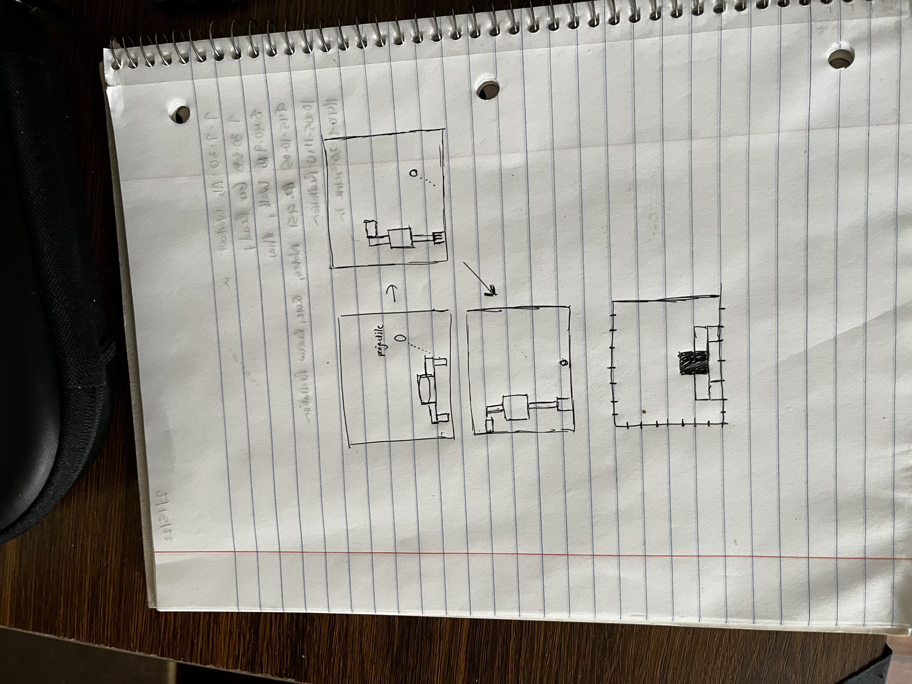

# Robot Crane Mania 

Author: Hridayesh Joshi

Design: Instead of having your sprite glide or run around on screen, you need to be clever with the way you move the robot.
It has 2 arms that you rotate to move around within the game. 

Screen Shot:
I don't have a screenshot of the working game, so instead I've included a screenshot of a diagram of what the game was intended
to look like;

How To Play:

The point of the game is to avoid oncoming projectiles. To move the robot, you press either the left or right arrow key 
to first choose which arm you want to rotate. Once the arm has been rotated 90 degrees, you select one of the four 
arrow keys to determine which face inside the cube you want to land on. 

This game was built with [NEST](NEST.md).
